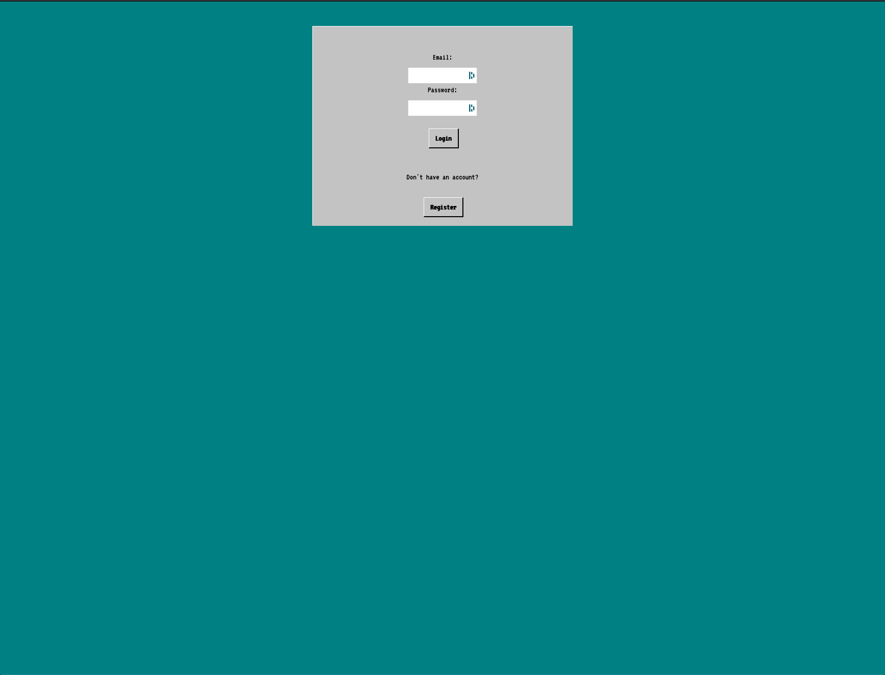
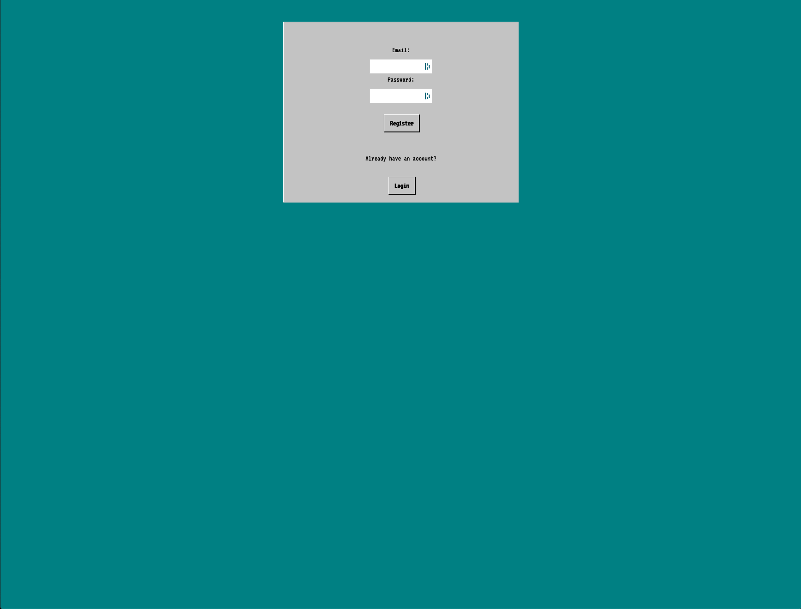
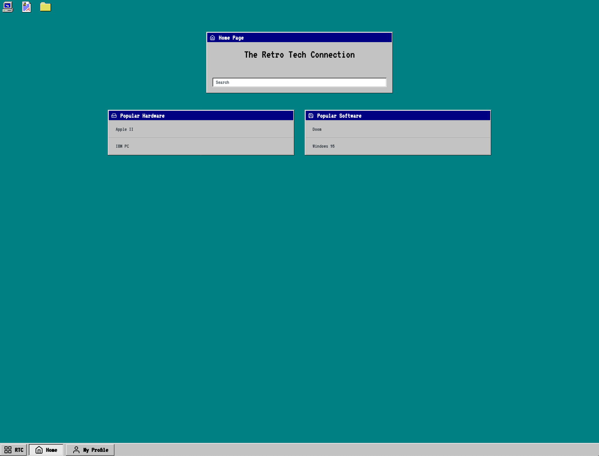
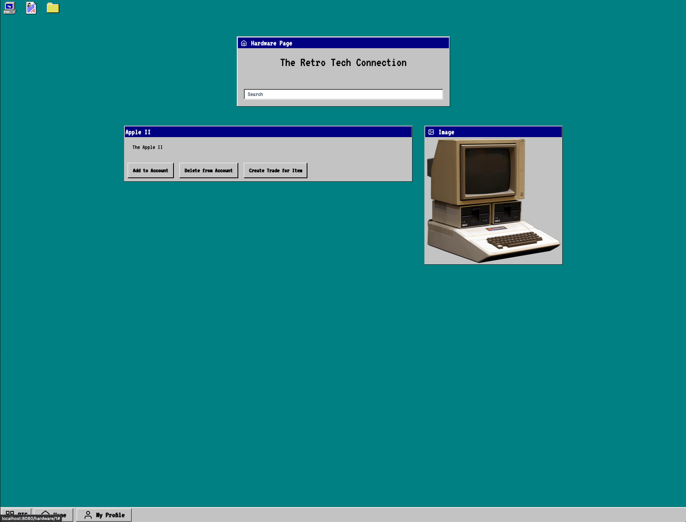
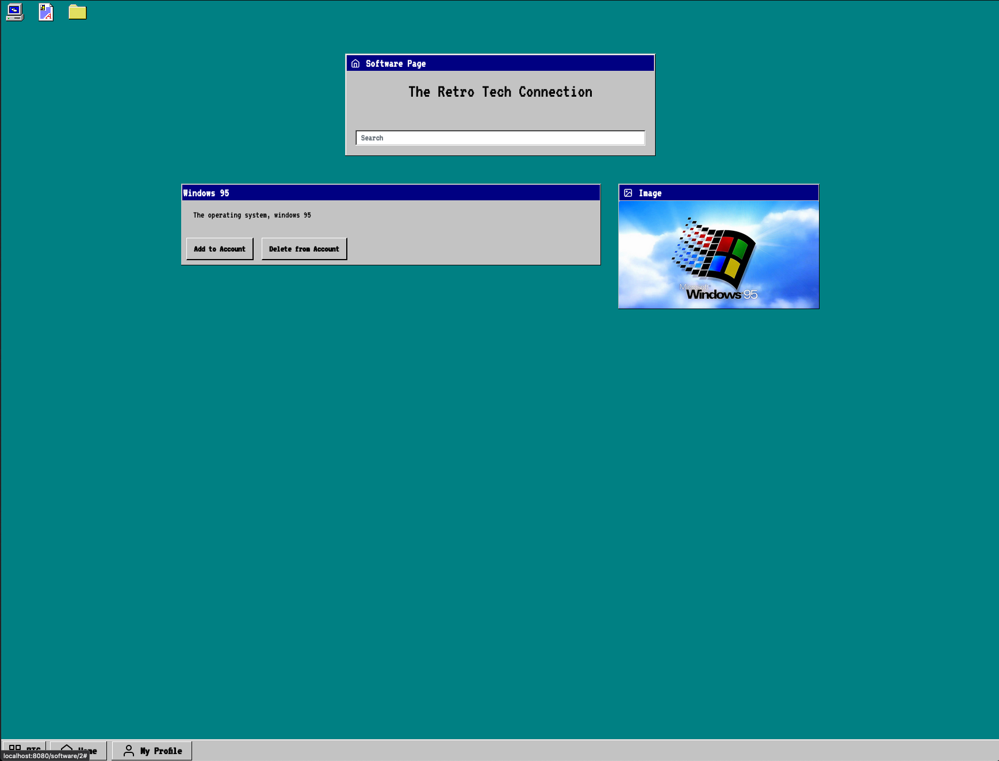

Title
-----
Team Xi

Subtitle
--------
Retro Tech Connection

Semester
--------
Spring 2020

Overview
---------
The Retro Tech Connection allows users to collect, share, and trade both their retro software and hardware collections. The site neatly categoriezes and organizes software and hardware as well as adding official descriptions and media (such as images). The site is innovative in its method of organization by user ownership allowing enthuiasts to easily compare and share their collections with others on one platform. The site acts as an interactive archive and organizational tool for users with collections they'd like to share with the world.

Team Members
------------
Dan Walsh, Will Hammond, Jackson Weber

User Interface
--------------
`/login`

Allows users to log into the website.

`/register`

Allows users to register for the website.

`/home`

Shows Software and Hardware on the site for the user to view.

`/hardware/:hardwareId`

Shows all information and media associated with a piece of hardware.

`/software/:softwareId`

Shows all information and media assocciated with a piece of software.

`/account`
*image*</br>
Shows the software, trades, and hardware that a user has.

API
----
Updated API is available at:</br>
https://documenter.getpostman.com/view/9923727/Szf3ZVRs?version=latest

Database
---------
```
hardware:
| Column       | Data Type | Description              |
|--------------|-----------|--------------------------|
| id           | int       | ID of the hardware       |
| name         | string    | The name of the hardware |
| description  | string    | Description of hardware  |
```
```
software:
| Column       | Data Type | Description              |
|--------------|-----------|--------------------------|
| id           | int       | ID of the software       |
| name         | string    | The name of the software |
| description  | string    | Description of software  |
```
```
users:
| Column       | Data Type | Description              |
|--------------|-----------|--------------------------|
| id           | int       | ID of the user           |
| email        | string    | The email of the user    |
| password     | string    | User's password          |
```
```
media:
| Column       | Data Type | Description              |
|--------------|-----------|--------------------------|
| id           | int       | ID of the media          |
| name         | string    | The name of the media    |
| URL          | string    | Source of the media      |
```
```
tag:
| Column       | Data Type | Description              |
|--------------|-----------|--------------------------|
| id           | int       | ID of the tag            |
| name         | string    | The name of the tag      |
```
```
trade:
| Column       | Data Type | Description              |
|--------------|-----------|--------------------------|
| id           | int       | ID of the trade          |
| ownerId      | int       | ID of the trade owner    |
| recipId      | int       | ID of trade recipient    |
| techId       | int       | ID of the tech traded    |
| accept       | boolean   | Trade accepted?          |
```
```
userOwnership:
| Column       | Data Type | Description              |
|--------------|-----------|--------------------------|
| userId       | int       | ID of the tech owner     |
| techId       | int       | ID of the owned tech     |
| techType     | string    | Type of tech owned       |
```
```
mediaRelation:
| Column       | Data Type | Description              |
|--------------|-----------|--------------------------|
| mediaId      | int       | ID of the media          |
| techId       | int       | ID of the related tech   |
| techType     | string    | Type of tech related     |
```
```
tagRelation:
| Column       | Data Type | Description              |
|--------------|-----------|--------------------------|
| tagId        | int       | ID of the tag            |
| techId       | int       | ID of the related tech   |
| techType     | string    | Type of tech related     |
```
```
authentication:
| Column       | Data Type | Description              |
|--------------|-----------|--------------------------|
| userId       | int       | ID of the user           |
| token        | string    | Auth token for the user  |
| exp          | time      | Expiration of token      |
```

URL Routes
-----------
`/home`  Homepage where users can see available hardware and software on the site. (Must be logged in to acccess)

`/login`  Where users can log into the site if they have an acccount.

`/register`  Where users can register for an account.

`/hardware/:hardwareId`  Displays the information associated with a piece of hardware. (Must be logged in to acccess)

`/software/:softwareId`  Displays the information associated with a piece of software. (Must be logged in to acccess)

`/account`  Displays the information associated with a user's account. (Must be logged in to acccess)

`/trade/:tradeId`  Displays the trade overview for a user. (Must be logged in to acccess)


Authentication
---------------
Users are authenticated by registering on the `/register` page, and then using their valid credientials on the `/login` page.
When a user registers, their password will be hashed for storage in the database and they will recieve a authorization token
upon login. This authorization token will expire 24 hours after they log in, but while they have that token (stored as a cookie)
they will have acccess to each of the pages on the site. Without a valid auth token, only `/login` and `/register` pages will
be available.

Division of Labor
------------------
### Dan Walsh ###

### Will Hammond ###

### Jackson Weber ###
Original wireframes</br>
homepage design</br>
Drew out API Planning/drafted original API</br>
Created Controller setup</br>
Created Original entities</br>
Setup Gulp to compile both frontend and backend with single command (for Heroku/ease)</br>
Created AbstractView system to manage frontend state change</br>
Built initial routing setup.</br>
Setup pg-promise in the project.</br>
Setup dotenv for enviroment variable storage.</br>
Connected database.</br>
Configured Hardware entities/methods to use the database.</br>
Drafted original DB schema.</br>
Documented database design.</br>
Configured Heroku to use Postgres DB.</br>
Fixed viewing media on hardware and software pages.</br>
User authorization and token validation.</br>
Write final document.</br>

Conclusion
----------
One of the largest (and most challenging) portions of the project was designing and writing a robust API for the site. Having
a portion of the course devoted to RESTful design or writing practice APIs would have made preparing for this portion of the
project easier. While designing/writing the API was challenging, the rest of the project became muuch easier afterward because
the functions of the site had been concretely defined at that point. One technical hurdle was properly compiling both the
frontend and backend TS files together as the team was new to using tools such as Gulp. Once Gulp was configured it was both
easy to automatically compile newly written code and deploy to Heroku with one command.
